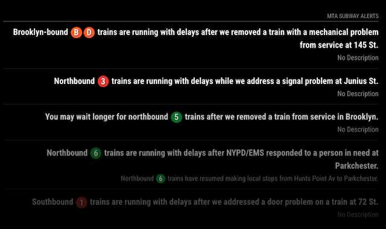

# MMM-MTA-SubwayAlerts

**MMM-MTA-SubwayAlerts** is a module for [MagicMirror²](mm) that displays real-time service alerts for the New York City MTA Subway. It allows you to filter alerts by specific subway lines.



This module utilizes the public [MTA's Realtime Data Feeds](https://api.mta.info/), specifically the [Subway Alerts API](https://api.mta.info/#/serviceAlerts).

Please refer to the [MTA Terms and Conditions](https://www.mta.info/developers/terms-and-conditions) for API usage.

## Installation

### Install

To install MMM-MTA-SubwayAlerts, navigate to your [MagicMirror²][mm] module folder in your terminal and clone the repository:

```bash
cd ~/MagicMirror/modules
git clone https://github.com/avianto/MMM-MTA-SubwayAlerts
```
Then, install the dependencies:

```bash
cd MMM-MTA-SubwayAlerts
npm install
```

### Update

To update the module, go to the module's directory and run the following commands:

```bash
cd ~/MagicMirror/modules/MMM-MTA-SubwayAlerts
git pull
npm install
```

## Using the module

To use this module, add it to the `modules` array in the `config/config.js` file:

A basic configuration will show the latest 5 subway alerts for all subway lines:

```js
{
  module: "MMM-MTA-SubwayAlerts",
  position: "top_left",
}
```
For more control, you can use all available options:

```js
{
  module: "MMM-MTA-SubwayAlerts",
  position: "top_right",  // Recommended positions: 
                          // "top_left", "top_right", "bottom_left", "bottom_right"
  config: {

    moduleTitle: "MTA Subway Alert" // Custom name
    updateInterval: 5 * 60 * 1000, 
    maxAlerts: 5,  

    // Filtering options
    filterRoutes: [], // Example: ["A", "C"] will show alerts only for A and C lines.       
                      // [] show all alerts.     
                      // Special tag "GENERAL" shows general alert, if any.

    // Content display options
    showIcons: true,               
    showDescription: true, 
    showSpecialIcons: true,        
    noAlertsMessage: "No subway alerts currently.", 

    // Visual effects (Optional, defaults should work fine)
    animationSpeed: 1000,          
    fade: true,                    
    fadePoint: 0.25,               
  },
},
```

## Configuration options and defaults

### Main functions:

|Option|Type|Default|Description
-|-|-|-
`updateInterval`|`number`|`300000`(5 minutes)|How often to refresh alerts (in milliseconds).
`filterRoutes`|`array` of `string`s|`[]` (Empty)|An array of subway line IDs to filter alerts.<br>Only alerts affecting these lines will be displayed.<br>Use [official MTA route IDs](#mta-official-route-ids-as-of-052025).<br>Example: ["A", "C", "E"] will show alerts only for A, C, and E lines.<br>To include general system-wide alerts (those not specific to any route),<br>add 'GENERAL' to this array. Example: ["1", "2", "3", "GENERAL"].<br>If this array is empty (`[]`) or `null`, all alerts will be shown.
`showDescription`|`boolean`|`true`|Display the full alert description (if available).
`maxAlerts`|`number`|`5`|Maximum number of alerts to display at one time.
`animationSpeed`|`number`|`10000`|Speed of module updates/transitions (in milliseconds).


### Cosmetics:
|Option|Type|Default|Description
-|-|-|-
`moduleTitle`|`string`|"MTA Subway Alert"|Module title
`showIcons`|`boolean`|`true`|Display subway icons instead of plain text
`showSpecialIcons`|`boolean`|`true`|Display special icons (accessibility or shuttle bus)
`noAlertsMessage`|`string`|"No subway alerts currently."|Message to show when no alerts are found or after filtering.
`fade`|`boolean`|`true`|Enable a fading effect for alerts as they near the bottom.
`fadePoint`|`number`|`0.25`| Alerts start fading at this percentage from the bottom.

## MTA Official Route IDs (as of 05/2025)

```
"1", "2", "3",      // Red lines
"4", "5", "6",      //Green lines
"7",                // Purple lines
"A", "C", "E",      // Blue lines
"B", "D", "F", "M", // Orange lines
"N", "Q", "R", "W", // Yellow lines
"G",                // Lime Green line
"L",                // Grey line
"J", "Z",           // Brown lines
"S",                // Shuttle lines (e.g., Franklin Ave, Rockaway Park)
"SIR"               // Staten Island Railway
```

[mm]: https://github.com/MagicMirrorOrg/MagicMirror
